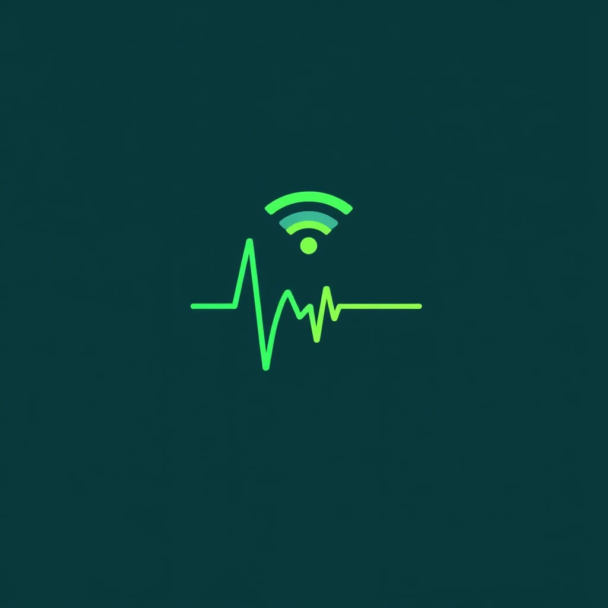
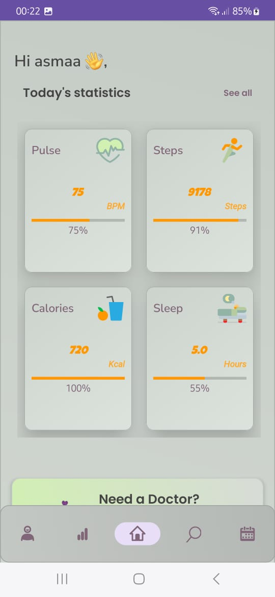
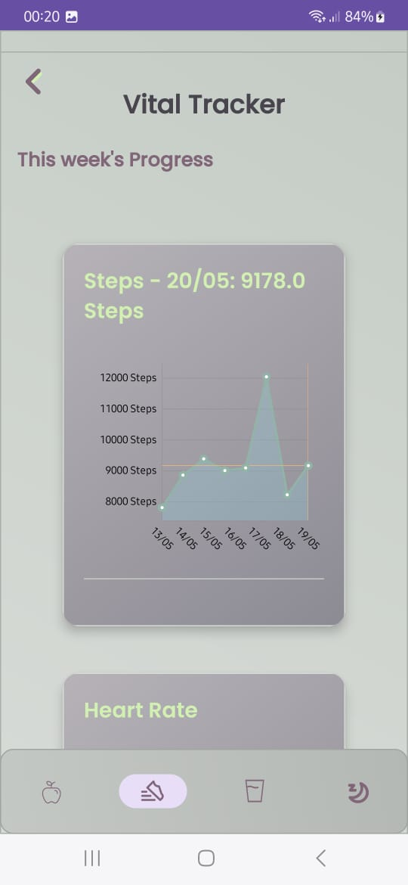
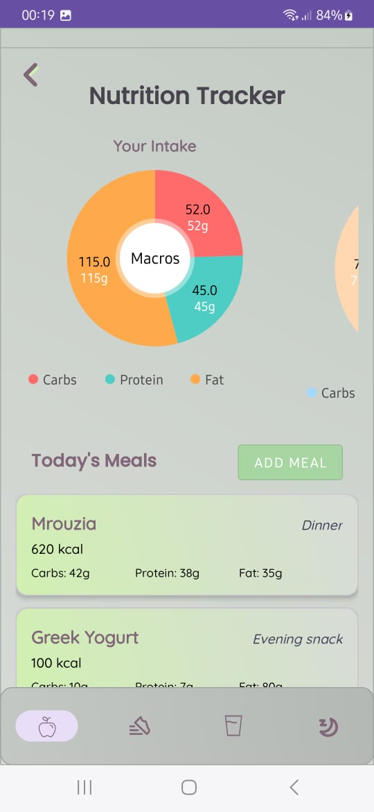

# VitaGlow – Health & Wellness Tracker

## 🎓 Academic Project
**Bachelor Graduation Project – Software Engineering (2024–2025)**  
*Developed at Ibn Zohr University*  
*Supervised by: Prof. Nour-Eddine Moussa*

---

## 📱 Project Overview

VitaGlow is a comprehensive health and wellness tracking mobile application designed to help users monitor their daily health metrics, set goals, and maintain a healthier lifestyle. Built with Java and integrated with Firebase Firestore, the application offers a seamless and secure experience for health monitoring.

---

## ✨ Key Features

| Category | Features |
|----------|----------|
| **Vital Signs** | Track heart rate, blood pressure, and body temperature |
| **Physical Activity** | Count steps, track exercises (running, cycling, etc.) |
| **Sleep Analysis** | Monitor sleep cycles and quality with personalized improvement suggestions |
| **Nutrition** | Log meals, analyze nutritional value, and track caloric intake |
| **Hydration** | Monitor daily water intake with timely reminders |
| **Healthcare** | Find doctors by specialty and city |
| **Medication & Appointments** | Set reminders for medications and medical consultations |
| **Smart Recommendations** | Receive customized advice based on collected data |
| **Data Sharing** | Share health reports with healthcare professionals |
| **Analytics** | Generate comprehensive reports with visual graphs |

---

## 📊 Technology Stack

- **Frontend**: Java for Android
- **Backend**: Firebase Firestore
- **Authentication**: Firebase Authentication
- **Analytics**: Firebase Analytics
- **Storage**: Firebase Cloud Storage
- **APIs**: Google Fit Integration, Health Connect API

---

## 🎯 Project Objective

The goal of VitaGlow is to provide users with a simple yet effective tool for daily health monitoring using mobile technology and connected devices. This includes collecting physiological data, analyzing lifestyle habits, and delivering personalized recommendations to improve overall well-being.

---

## 📱 Application Screenshots

    
    
    

---

## 🩺 Healthcare Integration

VitaGlow goes beyond typical health tracking by offering a comprehensive doctor finder feature that allows users to:

- **Search by Specialty**: Find doctors based on their medical specialty (cardiologists, dermatologists, etc.)
- **Location-Based Search**: Filter healthcare providers by city or proximity to your location
- **Provider Profiles**: View detailed information about doctors including qualifications and experience
- **Appointment Scheduling**: Request appointments directly through the application
- **Reviews & Ratings**: Access patient reviews to make informed healthcare decisions

This integration of healthcare provider access with health tracking creates a seamless experience for managing your complete wellness journey.

---

## 🧑‍💻 Authors

- **Asmaa Aandadi** - [vitaglow37@gmail.com](mailto:vitaglow37@gmail.com)
- **Hajar Amezoug** - [vitaglow37@gmail.com](mailto:vitaglow37@gmail.com)

---

## 🔧 Installation

### Requirements
- Android 7.0 (Nougat) or higher
- 100MB free storage space
- Internet connection for data synchronization

### Download
You can download the latest version of the app from the [Releases page](https://github.com/az-maa/VitaGlow-App/releases).

> **Note**: You may need to enable "Install from Unknown Sources" on your Android device to install the .apk.

---

## 🤝 Contributing

This is an academic project, but suggestions are welcome. Please feel free to submit issues or pull requests.

---

## 📄 License

This project is for academic use only.  
© 2025 Asmaa Aandadi & Hajar Amezoug. All rights reserved.

---

## 🙏 Acknowledgements

- Prof. Nour-Eddine Moussa for project guidance
- Ibn Zohr University for academic support
- Firebase team for their excellent documentation
- All testers who provided valuable feedback during development
